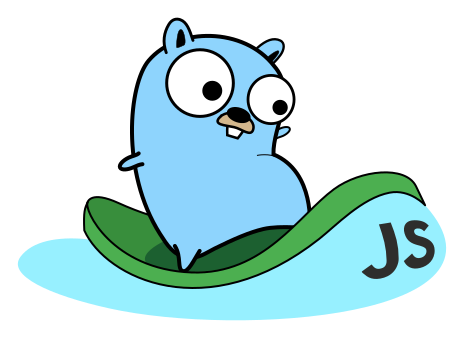

<h1 align="center">
    <a href="https://github.com/Shpota/goxygen/tree/master/.github/README.md">
        
    </a>
    <a href="https://github.com/Shpota/goxygen/tree/master/.github/README_zh.md">
        
    </a>
    <a href="https://github.com/Shpota/goxygen/tree/master/.github/README_ua.md">
        
    </a>
    <a href="https://github.com/Shpota/goxygen/tree/master/.github/README_ru.md">
        
    </a>
    <a href="https://github.com/Shpota/goxygen/tree/master/.github/README_ko.md">
        
    </a>
    <a href="https://github.com/Shpota/goxygen/tree/master/.github/README_pt-br.md">
        
    </a>
    <a href="https://github.com/Shpota/goxygen/tree/master/.github/README_by.md">
        
    </a>
    <a href="https://github.com/Shpota/goxygen/tree/master/.github/README_fr.md">
        
    </a>
    <a href="https://github.com/Shpota/goxygen/tree/master/.github/README_es.md">
        
    </a>
    <br>
    Goxygen
    <a href="https://github.com/Shpota/goxygen/actions?query=workflow%3Abuild">
        
    </a>
    <a href="https://github.com/Shpota/goxygen/releases">
        
    </a>
    <a href="https://gitter.im/goxygen/community">
        
    </a>
    <a href="https://github.com/Shpota/goxygen/pulls">
        
    </a>
</h1>



**Genera un proyecto Web con Go, Angular/React/Vue, y MongoDB en segundos.**

Goxygen aspira a salverte tiempo a la hora de crear un nuevo proyecto,
creando el esqueleto de una aplicacion con la configuracion ya generada,
para que puedas comenzar a implementar la logica de tu negocio inmediatamente.
Goxygen genera el backend con Go, lo conecta con los componentes del frontend
y te ofrece los archivos necesarios para que docker componga los entornos de desarrollo y produccion.

## Como se usa
Necesitas tener instalado Go 1.11 o posterior en tu equipo.

```go
go get -u github.com/shpota/goxygen
go run github.com/shpota/goxygen init my-app
```
Este codigo genera un proyecto en el directorio ``my-app``.

Por defecto, se genera un projecto basado en React. Puedes elegir entre Angular, React y Vue
pasando `angular`, `react` y `vue` a la etiqueta `--frontend`. Por ejemplo:

```go
go run github.com/shpota/goxygen init --frontend vue my-app
```

El proyecto generado se puede correr utilizando `docker-compose`:
```sh
cd my-app
docker-compose up
```

Una vez la construccion se haya completado la aplicacion estara accesible 
a traves de http://localhost:8080.

Puedes encontrar más detalles en como trabajar con el proyecto generado en su archivo README.


## Estructura de un proyecto generado (Aplicacion basada en React)


    my-app
    ├── server                   # archivos de GO
    │   ├── db                   # comunicaciones de MongoDB
    │   ├── model                # objetos de dominio
    │   ├── web                  # REST APIs, web server
    │   ├── server.go            # l punto de entrada del servidor
    │   └── go.mod               # Dependencias del servidor
    ├── webapp                    
    │   ├── public               # iconos, archivos estaticos e index.html
    │   ├── src                       
    │   │   ├── App.js           # componente principal de React
    │   │   ├── App.css          # estilos componente-especifico de la App
    │   │   ├── index.js         # punto de entrada principal de la aplicacion
    │   │   └── index.css        # estilos globales
    │   ├── package.json         # dependencias del front end
    │   ├── .env.development     # contiene endpoint del API para entorno de desarrollo
    │   └── .env.production      # endpoint de la API para entornos de produccion
    ├── Dockerfile               # constructor de backend y frontend juntos
    ├── docker-compose.yml       # descriptor del despliegue para el entorno de produccion
    ├── docker-compose-dev.yml   # ejecuta MongoDB localmente para necesidad de desarrollo
    ├── init-db.js               # genera una collecion de MongoDB con informacion de prueba
    ├── .dockerignore            # especifica archivos a ignorar en la construccion de Docker
    ├── .gitignore
    └── README.md                # guia de como utilizar la repo generada 

No se han incluido archivos como las informacion de prueba o ejemplos de los componentes para simplicar.

## Dependencias

Goxygen genera la estructura basico de uin proyecto y no te obliga a
utilizar ningun set especifico de herramientas. Es por eso que no incluye
dependencias innecesarias, tan solo utiliza
[mongo-go-driver](https://github.com/mongodb/mongo-go-driver) en el backend y
[axios](https://github.com/axios/axios) para pryectos de React y Vue.
Proyectos en Angular solo utilizan librerias especificas.

## Como contribuir

Si encuentras algun bug o tiene ideas para mejorar el proyecto
[abre una hilo](https://github.com/Shpota/goxygen/issues) y lo
solucionaremos lo antes posible. tambien puedes proponer cambios
a traves de pull request. Haz un fork, realiza cambios y mandanos
un pull request y lo revisaremos. Tambien tenemos un 
[Gitter chat](https://gitter.im/goxygen/community) donde discutimos los cambios.

### Creditos
Goxygen's logo was created by [Egon Elbre](https://twitter.com/egonelbre).
